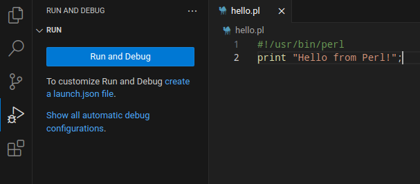
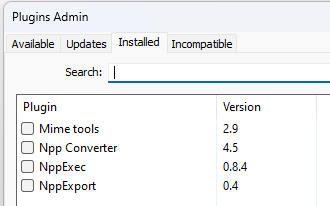
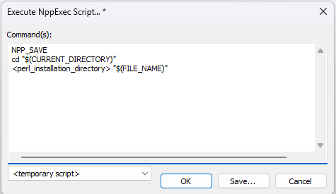
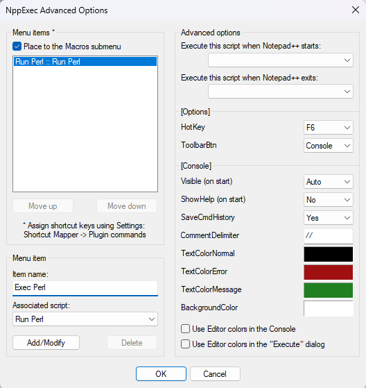
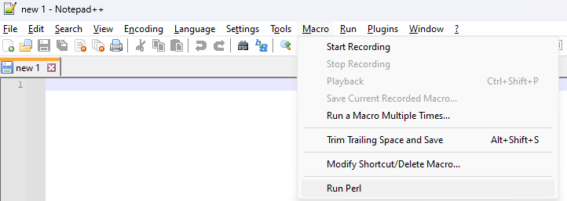
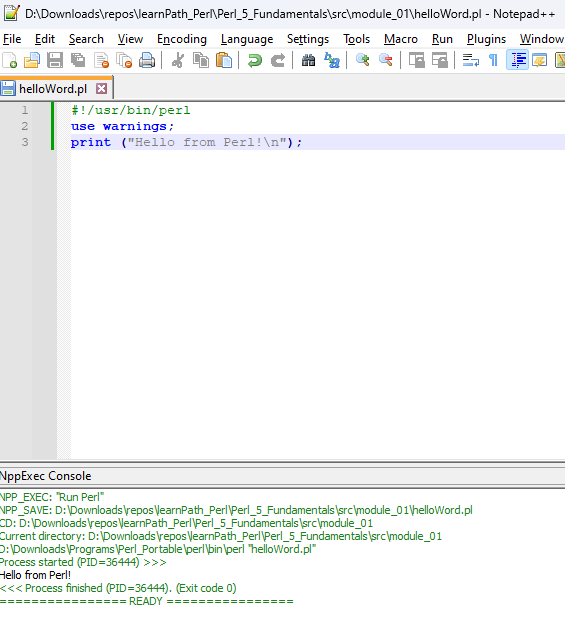

# Module 01

Suppose you have been working in the financial domain or any company that handles credit card data. In that case, you must be aware of the [PCI standards](https://www.pcisecuritystandards.org/document_library/) that mandate the credit card numbers to be masked in your application and database logs.

Currently, the application under consideration writes unmasked credit card numbers to the log files. And with the PCI audit approaching, the management has approached Julia, who is a system administrator, to develop a utility to run the log files and mask the exposed credit card numbers. They also want to maintain an audit trail when the utility is run.

The requirements is:

- Scan the directory containing the log files.
- Filter all the files with the `.log` extension.
- Scan for credit card numbers
- Mask the card data except the last four digits.
- Write the run timestamp to a database.

Let's see how Julia implements these requirements using the Perl language.

## Setting up development environment

If you're using a MacOS or a Linux distro, Perl is already included. You can check the current version available in your system by running the command `perl -v` on a command prompt.

Now if you're using a Windows, you can download [Strawberry Perl](https://strawberryperl.com/releases.html). Then update your **Path environment variables** by providing the current location of the `/perl/bin/` folder.

### Linux / MacOS

For using the [Perl Language Server and Debugger Extension](https://github.com/richterger/Perl-LanguageServer?tab=readme-ov-file#references), be sure to install the following dependencies:

```cmd
cpanm AnyEvent --force
cpanm AnyEvent::AIO
cpanm Perl::LanguageServer
```

First check what is your `make` distribution available for Perl running `perl -V:make`. Depending on the Linux distro futher packaged are needed to be install. I suggest you to take a look at [this gist](https://gist.github.com/hakonhagland/15800c09d36ba8ee034ca1b962ad33e2).




### Windows

Using Notepad++, access the _Plugins Admin..._ section and install the _NppExec_ plugin.



After installing, go to _Plugins > NppExec > Execute NppExec Script_ to create and save a new script according to the given illustration. Remember to replace `<perl_installation_directory>` with the actual path to `perl` exec on your machine.



Enable the macro accessing _Plugins > NppExec > NppExec Advanced Options_ to create a new menu item.



After reinitializing Npp++, you'll see that a new Macro has been created.



Now you're able to run Perl scripts directly from Npp++.



## What happened

The shebang is quite common on Perl scripts and is used to inform the location of the perl exec on Linux environments, notice that not all Linux environments will have Perl on the same location.

The pragma `use warnings` is useful to turn on or off warnings during the execution of our script.

Like Java, Perl is both compiled and interpreted language, but it does not store the bytecode on a separated file, and it happens in just a one-step process.

## What we built on this module

Now to start our credit card masking utility, we will take the first step and accept the directory from the command line. The logs within this directory will eventually be scanned for unmasked credit card numbers.

Our next step is to accept an input from the user, we could either pass it as an argument to the Perl program, or accept the value from the command line interactively.

```perl
#!/usr/bin/perl

use warnings;

$dirname = $ARGV[0];

print "Now we will scan for unmasked credit card numbers in the directory: $dirname\n"; 
```

### Using Perl native debugger

As your program starts to get complex, you will be stumped with errors that will require the help of a debugger. On [this site](https://debugger.perl.org/tools.html) you'll find many auxiliary tools to help you debugging your Perl scripts.

Here we're going to explore the built-in command line debugger provided by Perl, it may looks cryptic at first sigh compared to other visual debuggers, but trust me, this is a lot easier. Documentation available [here](https://perldoc.perl.org/perldebug). There are many debugger commands that you can use like, print the value of an expression, step through the execution, execute over subroutine calls, set a breakpoint before a line, set a breakpoint based on a condition, and much, much more.

```cmd
$ perl -d take_user_input.pl "./my_log_directory/"

Loading DB routines from perl5db.pl version 1.57
Editor support available.

Enter h or 'h h' for help, or 'perldoc perldebug' for more help.

main::(.\take_user_input.pl:7): $dirname = $ARGV[0];

        DB::DB called at .\take_user_input.pl line 7
  DB<1> p $dirname

  DB<2> n
main::(.\take_user_input.pl:9): print "We will scan for unmasked credit card numbers in the directory: $dirname\n";
  DB<2> p $dirname
./my_log_directory/
  DB<3> q
```

First we execute our Perl script in debugger mode passing the directory name as an argument with the line:

```cmd
perl -d take_user_input.pl "./my_log_directory/"
```

Then, inside the built-in debugger, we can see that it's currently waiting at line 7, and we know this based on the statement it prompts `main::(.\take_user_input.pl:7): $dirname = $ARGV[0];`.

We can evaluate expressions and print variables inside the inner prompt of the debugger, the one with starts with `DB<someNumber>`. At first we tried to print the value of our variable `$dirname`, and how it wasn't already assigned it returned nothing. Them we move our debugger to the next line using `n` and then tried to print it again so it returned `./my_log_directory/`. To exit the debugger and abort the execution of our script we used `q`.

This is a handy, lightweight debugger that can come to your rescue if you quickly want to check the value of certain variables during your development. But when you have a long program, it's not practical to step through line-by-line, you may want to jump to a specific line containing a specific variable that you want to monitor, and to archieve this you can use breakpoints.

Supposing we have the program:

```perl
#!/usr/bin/perl
use warnings;

$first_arg = $ARGV[0];

print("Hi!\n");
print("Hello!\n");
print("Goodbye!\n");
print("Farewell!\n");
```

Then we want to advance our debugger to line 8.

```cmd
$ perl -d demo_breakpoint.pl "salutations"

Loading DB routines from perl5db.pl version 1.57
Editor support available.

Enter h or 'h h' for help, or 'perldoc perldebug' for more help.

main::(.\demo_breakpoint.pl:4): $first_arg = $ARGV[0];

        DB::DB called at .\demo_breakpoint.pl line 4
  DB<1> v
1       #!/usr/bin/perl
2:      use warnings;
3
4==>    $first_arg = $ARGV[0];
5
6:      print("Hi!\n");
7:      print("Hello!\n");
8:      print("Goodbye!\n");
9:      print("Farewell!\n")
  DB<1> b 7
  DB<2> v 3
1       #!/usr/bin/perl
2:      use warnings;
3
4==>    $first_arg = $ARGV[0];
5
6:      print("Hi!\n");
7:      print("Hello!\n");
8:b     print("Goodbye!\n");
9:      print("Farewell!\n");
  DB<3> c
Hi!
Hello!
main::(.\demo_breakpoint.pl:8): print("Goodbye!\n");
  DB<3> p $first_arg
salutations
  DB<4> q
```

Here we initialized our `demo_breakpoint.pl` in debugger mode and used the `v` command to display a few lines arount the current position of our debugger, which is indicated using the arrow mak at the right of the current line `4==>`.

Then we used the `b` command to set a breakpoint to the line which we would like to set a breakpoint, line 8. After that we wanted to confirm if the breakpoint was set correct using the `v` command again, but this time informing an amount of lines to show around the current line, and we can see the `b` character next to the line 8 `8:b`. Hence we've set a breakpoint, we skipped our debugger right to it using the `c` command, the debugger informs us he stoped at line 8 by printing the statement `main::(.\demo_breakpoint.pl:8): print("Goodbye!\n");` to the console.
