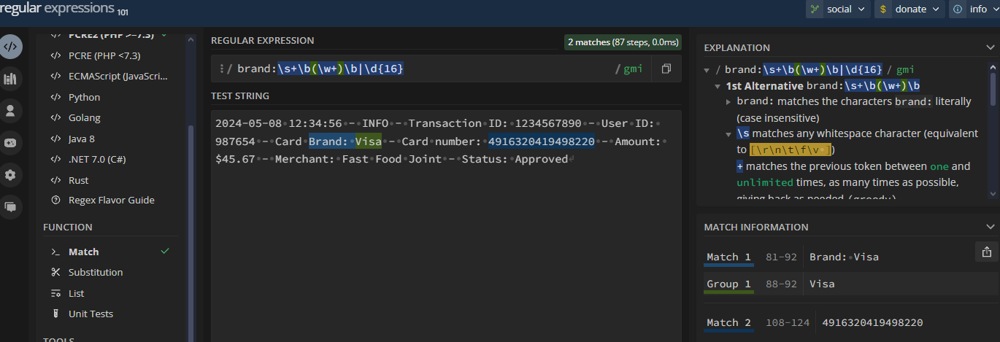

# Module 05

In this module we're going to build the core PCI compliance enforcer tool. We'll start by introducing the basic pattern matching in Perl. Though we're going to use a lot of regular expressions in action, they're not be detailed in depth.

Now based on the [log file](./src/module_05/transaction.log), our enhancement requirement for this clip is to read input file line by line, test if the line contains the credit card type entered by the user, if so then print a statement _Credit Card Found_, followed by the filename, and write the same message to the output file.

First part (read the valid credit card types entered by the user): 

```perl
#!/usr/bin/perl

use strict;
use warnings;

print "Enter the credit card brands (visa, american express, maestro, all...): \n";
my $str_card_types = <STDIN>;
# the user can input the word all to indicate any credit card
# the user must provide the card brands separeted by comma and space
my @card_types = split /, /, $str_card_types;
```

Second part where we match the card with the lines inside the __log file__ and write it to the output file.

```perl
while (<$file_handle>) {
    if ( lc("all") ~~ @card_types ) {
        print "operation detected. \n";
        print $output_file_handle " Credit Card Found in $log_directory.$filename\n";
    }
    else {
        for my $card (@card_types) {
        $card =~ s/[\r\n]+//g;     #fancy way to remove line breaks
        $card =~ s/^\s+|\s+$//g;   #fancy way to trim

            # example regex pattern for literal string
            # /someString/i   ==== i indicates case insensitive
            if ( lc($_) =~ lc($card) ) {
                print "operation detected. \n";
                print $output_file_handle " Credit Card $card Found in line $.\n";
            }
        }
    }
}
```

I recommend [this site](https://regex101.com) to test your regex patterns.

---

Based on our previous requirement, let's see how we could have managed to do if the purpose was the opposite, so if we not found the given credit cards then a message should be printed.

To check if a line does not contain a specific pattern, we need to use the exclamation mark followed by tilde (`!~`). Our code would end with something similar to this, notice we've changed the operator `OR` to `AND`.

```perl
while (<$file_handle>) {
    for my $card (@card_types) {
        $card =~ s/[\r\n]+//g;     #fancy way to remove line breaks
        $card =~ s/^\s+|\s+$//g;   #fancy way to trim

        if ( lc($_) !~ lc($card) ) {
            print "operation not detected. \n";
            print $output_file_handle " Credit Card $card NOT Found in line $.\n";
        }
    }
}
```

Pretty neat right? Imagine another scenario where your input file no longer has any card types. Instead, it has labels such card1, card2, card3, and so on, for every occurrence of the card. For this exercise we're going to work on [this log file](src/module_05/transaction_labeled.log).

It's just not practical to inspect if line contains a given label by separating them with a logical `OR`. Instead, we can use a regex character class to achieve it. Character classes are typically enclosed in squared brackets, and one of characters within the square brackets is matched.

So, we can write our regex in two forms:

- Specifying each character.
```perl
/card[1234567]/
```

- Or providing a range.

```perl
/card[1-7]/
```

```perl
while (<$file_handle>) {
    if ( lc($_) =~ /card[1-7]/ ) {
        print "operation detected. \n";
        print $output_file_handle " Credit Card Found in line $.\n";
    }
}
```

At this point you should've noticed that `$.` is a special variable for the current line number correct? Now think for a moment, what if the input file grows in size and the number of cards increased along with it? How will you handle that scenario?

Well, in this case you can use the regex `\d` character and `+` quantifier to indicate the presence of a digit followed by the string card

```perl
/card[\d+]/
```

When you refer to some Perl documentation and tutorials online, you might see a `m` character prefixing the matching pattern. Like this:

```perl
m/card[\d+]/
```

This is perfectly valid, and the prefix `m` is a __match operator__ used by regex. So when it comes to regex, there is always more than one way to accomplish the same task.

---

Until now, you've learned to write a static text when a credit card is found. We will enhance it and print the actual credit card number to the output file. The requirement is to read the input file line by line and check if the line that is read contains the given credit card brand, if so extract the credit card number next to card type and print the extracted text and the corresponding line number to the console on the output file.

One way to catch the credit card number, is by simply searching a string containing sixteen numbers together.

```perl
/\d{16}/
```

And to detect the corresponding credit card branch this matcher works just as fine.

```perl
/brand:\s+\b(\w+)\b|\d{16}/i
```

To combine them, you use a single pipe `|` as this:

```perl
/brand:\s+\b(\w+)\b|\d{16}/gmi
```

Take your time to test and explore another possibilities of matchers that could be used.



Perl stores the results of group matchers on special variables like `$1`, `$2`, and so on. 

```perl
while (<$file_handle>) {
    my @matches = ($_ =~ /((?<= brand:)\s+\b(\w+)\b|\d{16})/gmi);
    my $card_brand = $matches[1];
    my $card_number = $matches[2];

    if ($card_brand ne "" && $card_number ne "") {
        print ("Credit Card Brand: $card_brand, with Number: $card_number, found at line $.\n");
        print $output_file_handle "Credit Card Brand: $card_brand, with Number: $card_number, found at line $.\n";
    }
}
```

Our approach above is to retain all possible group matchers of our regex in a list, then check if that list stores not empty strings, if its true we write the card brand name and the card number to the output file.

---

Until here, we searched for a pattern and extracted the matching pattern. Our requirement now is to search for the credit card number in each line, and replace it with asterisks, except the last four digits. 

To do that, Perl offers a substitution operator that can be used like described below:

```perl
s/current_text/replacement_text/<modifier>
```

The letter **s** indicates that this is a substitution operation. Between the first two slashes is the regex that matches the text to be replaced, and the text or the expression between the second two slashes is the actual replacement text. After the final slash, we can provide a letter corresponding to the regex modifier.

Let's figure out the regex that fits our needs.

We can use a _positive look ahead expression_, it is an assertion used to determine success or failure of the pattern ahead. It is returned using the syntax `(?= <expression>)` and does not match anything, it simply asserts that what immediately follows the current position in the string is actually the test pattern.

```perl
/\d+(?=\d{4})/
```

The look ahead expression above has a test pattern that asserts what follows from the current position of the string is four digits. We can check that it actually matches our credit card number, except the last four digits. This matched 12 digits is what needs to be replaced with asterisks.

Now that we've figured out the first part of the substitution, let's try to discover the missing second part.

```perl
s/(\d+)(?=\d{4})/************/
```

Look and try this code. It seems to work just fine. So maybe that's an acceptable solution right? Maybe not. It's never a good idea to hard code anything in our script, so let's introduce a logic that dynamically calculates the number of asterisks.

```perl
s/(\d+)(?=\d{4})/'*' x length($1)/e
```

The modifier `e` evaluates the replacement text as a Perl statement and uses a return value from this statement as a replacement text.

```perl
while (<$file_handle>) {
    if ($_ =~ s/(?<=number:\s)(\d+)(?=\d{4})/'*' x length($1)/e) {
        print "Detected card number to be replaced at line $..\n";
        print $output_file_handle "$_";
    }
}
```

You can try to count the number of asterisks, it works even with credit cards with less than 16 digits.

---

Let's cover another business requirement which states that we need to translate all the text in the line containing the credit card to uppercase.

Similar to substitution, Perl provides a translation operator `tr` that lets you replace character by character in the input string.

```perl
tr/source_char_list/translation_char_list/
```

We can introduce a translation operation that converts to uppercase as follows:

```perl
tr/[a-z]/[A-Z]/
```

So our code ends up looking like this:

```perl
while (<$file_handle>) {
    $_ =~ tr/[a-z]/[A-Z]/;
    if ($_ =~ s/(?<=NUMBER:\s)(\d+)(?=\d{4})/'*' x length($1)/e) {
        print "Detected card number to be replaced at line $..\n";
        print $output_file_handle "$_";
    }
}
```

Until now, we searched for card numbers, extracted them, substituted them, and translated them. But all output was written to a different file, which is not practical in a real-life scenario. You need to update the input file directly instead of writing it to a separate file.

Imagine you are processing a log file in your project, it is not practical to take all credit card numbers and write it in a separate file. You're supposed to rewrite or overwrite the existing log file that you're currently processing.

So far we've been following this strategy to help us grasp the concepts one at a time. Now that we have the basics covered, let's dive deep, update our input file directly, and mask the credit card numbers.

---

Let's revisit our logic so far and learn how to update the input file directly.

- Built a while loop to read the input file that ends in a **.log** extension, line by line.
- Used a regex translation operator to convert text from lowercase to uppercase.
- Extracted the credit card numbers except for the last four digits.
- From the length of the extracted string, we've computed the number of asterisks to be substituted.

Now, we need to figure out how to write this translated and substituted text back to the input file. What Perl function we've previously learned can be applied to achieve this? Of course, there is more than one way to do it, since we've learned about `tell` and `seek` functions, we will be using them.

Let's revisit the functionalities of `tell` and `seek` functions. A `tell` function is to get the current position of the read pointer. A `seek` function lets you move the read pointer to a specific position without actually reading the file contents.

So, before we start reading the file, let's introduce a scalar variable and assign it to the starting position of the file. As we start reading the file line by line, if the line contains the credit card details we will use the `seek` function and move the file pointer to that specific line's starting point. Then, we will transform the line by masking the credit card number details, and finally, we will write the contents back to the original file.

I figured a better regex to match credit card number without fixed length of sixteen digits:

```perl
/\d{15,}/
```

The above regex matches any sequence of 15 or more numbers on a string.

Now that we've structured our final algorithm, let's try to implement this logic.

The result you may achieve should look pretty much to this:

```perl
#!/usr/bin/perl

use strict;
use warnings;

print "Enter log directory: \n";
my $log_directory = <STDIN>;
$log_directory =~ s/^\s+|\s+$//g;    # trim

my $directory_handle;
opendir( $directory_handle, $log_directory ) or die "Could not open $log_directory: $!";

print "Start reading the final challenge log files...\n";

while ( my $filename = readdir($directory_handle) ) {
    if ( $filename =~ /final_challenge.log/ ) {
        print "Opening file: $filename\n";
        open( my $file_handle, '+<', $log_directory . $filename ) or die $!;

        my $read_pos = tell($file_handle);    #holds current position of the reading pointer
        while (<$file_handle>) {
            $_ =~ tr/[a-z]/[A-Z]/;
            if ( $_ =~ s/(?<=NUMBER:\s)(\d+)(?=\d{4})/'*' x length($1)/e ) {

                seek( $file_handle, $read_pos, 0 );
                print $file_handle $_;
            }

            $read_pos = tell($file_handle);
        }

        print "Closing file: $filename\n";
        close $file_handle;
    }
}
```

In a resume this Perl script reads log files from a specified directory, searches for lines containing the pattern `"NUMBER: [sequence of digits]"`, and replaces the digits with asterisks, except the last four ones. Here's a breakdown of the code:

- Asks the user to input a directory path where the log files are located.

- Removes leading and trailing whitespace from the user input.

- Attempts to open the directory specified by the user input. If unsuccessful, it prints an error message and terminates the script.

- Process Log Files:

  - Iterates over each file in the specified directory.
  - If the file name matches "final_challenge.log", it proceeds to process the file.
  - Opens the file for reading and writing ('+<') in binary mode.
  - Retrieves the current position of the reading pointer in the file.
  - Reads each line from the file.
  - Converts any lowercase letters to uppercase using the `tr` operator.
  - Checks if the line contains the pattern `"NUMBER: [sequence of digits]"`. If found, it replaces the digits in the number with asterisks.
  - Seeks back to the original position in the file.
  - Writes the modified line back to the file.
  - Updates the reading pointer position.
  - Closes the file.

- Once all files in the directory have been processed, it closes the directory handle.

Overall, this script is designed to sanitize log files by obfuscating sensitive numeric information (specifically, a number followed by four digits) before further processing or analysis.

## Summary

On this module you've learned that:

- How string patterns are matched in Perl using regular expressions.
- How to perform case-insensitive matching, and use regex character classes.
- Using an online regex utility to build and debug regular expressions step-by-step.
- Extraction of specific matchers from a string.
- How to use Perl substitution and translation operations over strings.
- How to update the original input file using file mode operators, plus the `tell` and `seek` functions.
